# Live Activity — Два сценария записи

## Текущее состояние

TypeScript-сторона **уже полностью реализована**:

- `[mobile/src/features/live-activity-recording/lib/recordingLiveActivity.ts](mobile/src/features/live-activity-recording/lib/recordingLiveActivity.ts)` — обёртка над `NativeModules.RecordingLiveActivityModule`
- `[mobile/src/screens/record/model/useRecording.ts](mobile/src/screens/record/model/useRecording.ts)` — уже вызывает `startRecordingLiveActivity`, `updateRecordingLiveActivity`, `endRecordingLiveActivity`

**Отсутствует** вся нативная (Swift) часть — ни модуля, ни Widget Extension, ни ActivityAttributes.

---

## Два сценария Live Activity

**Сценарий 1 — Запись активна, приложение свёрнуто (AppLock выключен)**

- Live Activity показывает: иконка микрофона + таймер + кнопка "Остановить"
- Таймер обновляется каждые 5 сек (уже реализовано в `useRecording.ts`, строки 91–94)
- Кнопка "Остановить" — это `Button` с AppIntent, который через `NSUserActivity` / deep link открывает приложение и останавливает запись без автотранскрипции

**Сценарий 2 — App Lock включён, приложение ушло в фон**

- `useRecording.ts` уже останавливает запись и вызывает `stopRecording()` (строки 200–212), что вызывает `endRecordingLiveActivity()`
- Нужно: Live Activity перейти в состояние "Запись сохранена" и показать это уведомление 3–5 сек, затем исчезнуть

---

## Что нужно сделать

### 1. Добавить Widget Extension Target в Xcode

Создать новый target типа `Widget Extension` (`com.apple.product-type.app-extension`) в `mobile/ios/`:

- Папка: `mobile/ios/RecordingWidget/`
- Файлы: `RecordingWidgetBundle.swift`, `RecordingLiveActivity.swift` (UI), `RecordingActivityAttributes.swift`

### 2. Определить `RecordingActivityAttributes`

```swift
// mobile/ios/RecordingWidget/RecordingActivityAttributes.swift
import ActivityKit

struct RecordingActivityAttributes: ActivityAttributes {
    struct ContentState: Codable, Hashable {
        var elapsedSeconds: Int
        var isStopped: Bool  // true → сценарий 2 (сохранено)
    }
}
```

### 3. SwiftUI UI для Live Activity

```swift
// mobile/ios/RecordingWidget/RecordingLiveActivity.swift
```

- **Динамическое состояние (`isStopped == false`)**: иконка mic + `Text(timerInterval:)` для точного таймера + кнопка "Stop" (AppIntent)
- **Финальное состояние (`isStopped == true`)**: иконка checkmark + "Запись сохранена"
- Поддержка Lock Screen (компактное) и Dynamic Island (minimal/expanded)

### 4. Создать нативный модуль `RecordingLiveActivityModule.swift`

```swift
// mobile/ios/VoiceInboxApp/RecordingLiveActivityModule.swift
@objc(RecordingLiveActivityModule)
class RecordingLiveActivityModule: NSObject {
  @objc func startActivity(_ resolve: RCTPromiseResolveBlock, rejecter reject: RCTPromiseRejectBlock) { ... }
  @objc func updateActivity(_ seconds: Double, resolver resolve: ..., rejecter reject: ...) { ... }
  @objc func endActivity(_ resolve: ..., rejecter reject: ...) { ... }
}
```

Модуль управляет `Activity<RecordingActivityAttributes>`:

- `startActivity` — запускает activity с `elapsedSeconds: 0, isStopped: false`
- `updateActivity(seconds)` — обновляет `elapsedSeconds`
- `endActivity` — переводит в `isStopped: true` и через 3 сек делает `dismiss`

### 5. Обновить entitlements и Info.plist

- `VoiceInboxApp.entitlements` — добавить `NSSupportsLiveActivities = true`
- `Info.plist` — добавить `NSSupportsLiveActivitiesFrequentUpdates = true` (уже есть по данным исследования)

### 6. Кнопка "Остановить" в Live Activity (AppIntent)

```swift
// mobile/ios/RecordingWidget/StopRecordingIntent.swift
struct StopRecordingIntent: AppIntent {
    func perform() async throws -> some IntentResult {
        // Открывает приложение через URL scheme: voiceinbox://stop-recording
    }
}
```

В приложении нужно обработать deep link `voiceinbox://stop-recording` → вызвать `stopRecording()` и сохранить без автотранскрипции.

### 7. Обработка deep link в React Native

В `[mobile/src/screens/record/ui/RecordScreen.tsx](mobile/src/screens/record/ui/RecordScreen.tsx)` — добавить `Linking.addEventListener('url', ...)` для обработки `voiceinbox://stop-recording`.

---

## Архитектура потоков

```mermaid
flowchart TD
    subgraph scenario1 [Сценарий 1 - AppLock выключен]
        A[Пользователь сворачивает приложение] --> B[Запись продолжается в фоне]
        B --> C[updateRecordingLiveActivity каждые 5 сек]
        C --> D[Live Activity: таймер обновляется]
        D --> E{Пользователь нажимает Stop в LA}
        E --> F[AppIntent → deep link voiceinbox://stop-recording]
        F --> G[RecordScreen обрабатывает → stopRecording без транскрипции]
    end

    subgraph scenario2 [Сценарий 2 - AppLock включён]
        H[Пользователь сворачивает/блокирует приложение] --> I[useRecording: next=background + isAppLockEnabled]
        I --> J[stopRecording вызывается автоматически]
        J --> K[endRecordingLiveActivity вызывается]
        K --> L[Native module: isStopped=true, показать Saved]
        L --> M[Live Activity исчезает через 3 сек]
    end
```




---

## Файлы для создания/изменения

- **Создать:** `mobile/ios/RecordingWidget/` (новая папка Widget Extension)
- **Создать:** `mobile/ios/RecordingWidget/RecordingActivityAttributes.swift`
- **Создать:** `mobile/ios/RecordingWidget/RecordingLiveActivity.swift`
- **Создать:** `mobile/ios/RecordingWidget/StopRecordingIntent.swift`
- **Создать:** `mobile/ios/RecordingWidget/RecordingWidgetBundle.swift`
- **Создать:** `mobile/ios/VoiceInboxApp/RecordingLiveActivityModule.swift`
- **Создать:** `mobile/ios/VoiceInboxApp/RecordingLiveActivityModule.m` (Obj-C bridge)
- **Изменить:** `mobile/ios/VoiceInboxApp/VoiceInboxApp.entitlements` — добавить `NSSupportsLiveActivities`
- **Изменить:** `mobile/ios/VoiceInboxApp.xcodeproj/project.pbxproj` — добавить Widget Extension target и файлы
- **Изменить:** `mobile/src/screens/record/ui/RecordScreen.tsx` — обработка deep link `stop-recording`  
mobile/src/features/live-activity-recording - также учти что есть уже созданный feature для  live activity

